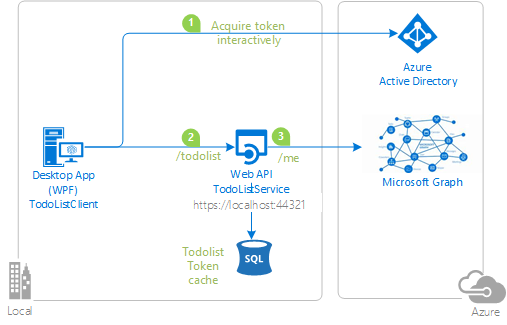

# Call a downstream web API (Microsoft Graph) from a web API secured with the Microsoft identity platform (Azure Active Directory) using the On-Behalf-Of flow

[](https://identitydivision.visualstudio.com/IDDP/_build/latest?definitionId=947)

## About this sample

### Overview

This sample demonstrates a .NET Framework Desktop app calling an ASP.NET Web API, which in turn calls the [Microsoft Graph](https://graph.microsoft.com) API using an [access token](https://docs.microsoft.com/azure/active-directory/develop/access-tokens) obtained using the [on-behalf-of flow](https://docs.microsoft.com/azure/active-directory/develop/v2-oauth2-on-behalf-of-flow). All these are secured using the [Microsoft identity platform (formerly Azure Active Directory for developers)](https://docs.microsoft.com/azure/active-directory/develop/)

1. The .Net client desktop application uses the [Microsoft Authentication Library (MSAL)](https://docs.microsoft.com/azure/active-directory/develop/msal-overview) to obtain an access token for the ASP.NET Web Api from the Microsoft identity platform for the authenticated user.
1. The access token is then used as a bearer token to authorize the caller in the ASP.NET Web API and then subsequently for Microsoft Graph API.

The flow is as follows:

1. Sign-in to the client application.
1. Acquire a token for the Asp.net Web API (`TodoListService`) and call it.
1. The Asp.Net Web API authorizes the caller, obtains another [access token](https://docs.microsoft.com/azure/active-directory/develop/access-tokens) using the [on-behalf-of flow](https://docs.microsoft.com/azure/active-directory/develop/v2-oauth2-on-behalf-of-flow) and then calls another downstream Web API ([Microsoft Graph](https://graph.microsoft.com)).

The **TodoListService** (the Asp.net Web API) uses a database to:

- Store the **ToDo** list.
- It also illustrates the [token cache serialization](https://github.com/AzureAD/microsoft-authentication-library-for-dotnet/wiki/token-cache-serialization) in a service.

   

### Scenario. How the sample uses MSAL.NET

- `TodoListClient` uses [MSAL.NET](https://github.com/AzureAD/microsoft-authentication-library-for-dotnet) to acquire an access token for the user in order to call **TodoListService** Web API. For more information about how to acquire tokens interactively, see [Acquiring tokens interactively with Public client application flows](https://github.com/AzureAD/microsoft-authentication-library-for-dotnet/wiki/Acquiring-tokens-interactively).
- Then `TodoListService` also uses [MSAL.NET](https://github.com/AzureAD/microsoft-authentication-library-for-dotnet) to get another access token using the on-behalf-of flow to call the [Microsoft Graph](https://graph.microsoft.com/). For details, see [Service to service calls on behalf of the user](https://github.com/AzureAD/microsoft-authentication-library-for-dotnet/wiki/on-behalf-of).

> Developers who wish to gain good familiarity of programming for Microsoft Graph are advised to go through the [An introduction to Microsoft Graph for developers](https://www.youtube.com/watch?v=EBbnpFdB92A) recorded session.

Both flows use the [OAuth 2.0](https://docs.microsoft.com/azure/active-directory/develop/active-directory-v2-protocols) protocol to obtain the tokens. For more information about how the protocols work in this scenario and other scenarios, see [Authentication Scenarios for Azure AD](http://go.microsoft.com/fwlink/?LinkId=394414).

## How to run this sample

To run this sample, you'll need:

- [Visual Studio 2019](https://aka.ms/vsdownload)
- An Internet connection
- An Azure Active Directory (Azure AD) tenant. For more information on how to get an Azure AD tenant, see [How to get an Azure AD tenant](https://azure.microsoft.com/documentation/articles/active-directory-howto-tenant/)
- A user account in your Azure AD tenant. This sample will not work with a Microsoft account (formerly Windows Live account). Therefore, if you signed in to the [Azure portal](https://portal.azure.com) with a Microsoft account and have never created a user account in your directory before, you need to do that now.
- TODO: Add a link to Sql server express requirement

### Step 1: Clone or download this repository

From your shell or command line:

```console
git clone https://github.com/Azure-Samples/ms-identity-aspnet-webapi-onbehalfof.git
```

or download and extract the repository .zip file.

> :warning: Given that the name of the sample is quiet long, and so are the names of the referenced packages, you might want to clone it in a folder close to the root of your hard drive, to avoid maximum file path length limitations on Windows.

### Step 2: Register the sample application with your Azure Active Directory tenant

There are two projects in this sample. Each needs to be separately registered in your Azure AD tenant. To register these projects, you can:

- either follow the steps [Step 2: Register the sample application with your Azure Active Directory tenant](#step-2-register-the-sample-application-with-your-azure-active-directory-tenant) and [Step 3: Configure the sample application to use your Azure Active Directory tenant](#step-3-configure-the-sample-application-to-use-your-azure-active-directory-tenant)
- or use PowerShell scripts that:
  - **automatically** creates the Azure AD applications and related objects (passwords, permissions, dependencies) for you. Note that this works for Visual Studio only.
  - modify the Visual Studio projects' configuration files.

<details>
  <summary>Expand this section if you want to use this automation:</summary>

1. On Windows, run PowerShell and navigate to the root of the cloned directory
1. In PowerShell run:

   ```PowerShell
   Set-ExecutionPolicy -ExecutionPolicy RemoteSigned -Scope Process -Force
   ```

1. Run the script to create your Azure AD application and configure the code of the sample application accordingly.
1. In PowerShell run:

   ```PowerShell
   cd .\AppCreationScripts\
   .\Configure.ps1
   ```

   > Other ways of running the scripts are described in [App Creation Scripts](./AppCreationScripts/AppCreationScripts.md)
   > The scripts also provide a guide to automated application registration, configuration and removal which can help in your CI/CD scenarios.

1. Open the Visual Studio solution and click start to run the code.

</details>

### Step 3: Configure the sample application to use your Azure Active Directory tenant

Follow the steps below to manually walk through the steps to register and configure the applications.

#### Choose the Azure AD tenant where you want to create your applications

As a first step you'll need to:

1. Sign in to the [Azure portal](https://portal.azure.com) using either a work or school account or a personal Microsoft account.
1. If your account is present in more than one Azure AD tenant, select your profile at the top right corner in the menu on top of the page, and then **switch directory**.
   Change your portal session to the desired Azure AD tenant.

#### Register the service app (TodoListService-OBO-sample-v2)

1. Navigate to the Microsoft identity platform for developers [App registrations](https://go.microsoft.com/fwlink/?linkid=2083908) page.
1. Select **New registration**.
1. In the **Register an application page** that appears, enter your application's registration information:
   - In the **Name** section, enter a meaningful application name that will be displayed to users of the app, for example `TodoListService-OBO-sample-v2`.
   - Under **Supported account types**, select **Accounts in this organizational directory only**.
1. Select **Register** to create the application.
1. In the app's registration screen, find and note the **Application (client) ID**. You use this value in your app's configuration file(s) later in your code.
1. Select **Save** to save your changes.
1. In the app's registration screen, click on the **Certificates & secrets** blade in the left to open the page where we can generate secrets and upload certificates.
1. In the **Client secrets** section, click on **New client secret**:
   - Type a key description (for instance `app secret`),
   - Select one of the available key durations (**In 1 year**, **In 2 years**, or **Never Expires**) as per your security posture.
   - The generated key value will be displayed when you click the **Add** button. Copy the generated value for use in the steps later.
   - You'll need this key later in your code's configuration files. This key value will not be displayed again, and is not retrievable by any other means, so make sure to note it from the Azure portal before navigating to any other screen or blade.
1. In the app's registration screen, click on the **API permissions** blade in the left to open the page where we add access to the APIs that your application needs.
   - Click the **Add a permission** button and then,
   - Ensure that the **Microsoft APIs** tab is selected.
   - In the *Commonly used Microsoft APIs* section, click on **Microsoft Graph**
   - In the **Delegated permissions** section, select the **User.Read** in the list. Use the search box if necessary.
   - Click on the **Add permissions** button at the bottom.
1. In the app's registration screen, select the **Expose an API** blade to the left to open the page where you can declare the parameters to expose this app as an Api for which client applications can obtain [access tokens](https://docs.microsoft.com/azure/active-directory/develop/access-tokens) for.
The first thing that we need to do is to declare the unique [resource](https://docs.microsoft.com/azure/active-directory/develop/v2-oauth2-auth-code-flow) URI that the clients will be using to obtain access tokens for this Api. To declare an resource URI, follow the following steps:
   - Click `Set` next to the **Application ID URI** to generate a URI that is unique for this app.
   - For this sample, accept the proposed Application ID URI (api://{clientId}) by selecting **Save**.
1. All Apis have to publish a minimum of one [scope](https://docs.microsoft.com/azure/active-directory/develop/v2-oauth2-auth-code-flow#request-an-authorization-code) for the client's to obtain an access token successfully. To publish a scope, follow the following steps:
   - Select **Add a scope** button open the **Add a scope** screen and Enter the values as indicated below:
        - For **Scope name**, use `access_as_user`.
        - Select **Admins and users** options for **Who can consent?**
        - For **Admin consent display name** type `Access TodoListService-OBO-sample-v2`
        - For **Admin consent description** type `Allows the app to access TodoListService-OBO-sample-v2 as the signed-in user.`
        - For **User consent display name** type `Access TodoListService-OBO-sample-v2`
        - For **User consent description** type `Allow the application to access TodoListService-OBO-sample-v2 on your behalf.`
        - Keep **State** as **Enabled**
        - Click on the **Add scope** button on the bottom to save this scope.

##### Configure the  service app (TodoListService-OBO-sample-v2) to use your app registration

Open the project in your IDE (like Visual Studio or Visual Studio Code) to configure the code.

> In the steps below, "ClientID" is the same as "Application ID" or "AppId".

1. Open the `TodoListService\Web.Config` file
1. Find the app key `ida:Tenant` and replace the existing value with your Azure AD tenant name.
1. Find the app key `ida:Audience` and replace the existing value with the App ID URI you registered earlier, when exposing an API. For instance use `api://<application_id>`.
1. Find the app key `ida:AppKey` and replace the existing value with the key you saved during the creation of the `TodoListService-OBO-sample-v2` app, in the Azure portal.
1. Find the app key `ida:ClientID` and replace the existing value with the application ID (clientId) of the `TodoListService-OBO-sample-v2` application copied from the Azure portal.

#### Register the client app (TodoListClient-OBO-sample-v2)

1. Navigate to the Microsoft identity platform for developers [App registrations](https://go.microsoft.com/fwlink/?linkid=2083908) page.
1. Select **New registration**.
1. In the **Register an application page** that appears, enter your application's registration information:
   - In the **Name** section, enter a meaningful application name that will be displayed to users of the app, for example `TodoListClient-OBO-sample-v2`.
   - Under **Supported account types**, select **Accounts in this organizational directory only**.
1. Select **Register** to create the application.
1. In the app's registration screen, find and note the **Application (client) ID**. You use this value in your app's configuration file(s) later in your code.
1. In the app's registration screen, select **Authentication** in the menu.
   - If you don't have a platform added, select **Add a platform** and select the **Public client (mobile & desktop)** option.
   - In the **Redirect URIs** | **Suggested Redirect URIs for public clients (mobile, desktop)** section, select **https://login.microsoftonline.com/common/oauth2/nativeclient**
1. Select **Save** to save your changes.
1. In the app's registration screen, click on the **API permissions** blade in the left to open the page where we add access to the APIs that your application needs.
   - Click the **Add a permission** button and then,
   - Ensure that the **My APIs** tab is selected.
   - In the list of APIs, select the API `TodoListService-OBO-sample-v2`.
   - In the **Delegated permissions** section, select the **Access 'TodoListService-OBO-sample-v2'** in the list. Use the search box if necessary.
   - Click on the **Add permissions** button at the bottom.

##### Configure the  client app (TodoListClient-OBO-sample-v2) to use your app registration

Open the project in your IDE (like Visual Studio or Visual Studio Code) to configure the code.

> In the steps below, "ClientID" is the same as "Application ID" or "AppId".

1. Open the `TodoListClient\App.Config` file
1. Find the app key `ida:Tenant` and replace the existing value with your Azure AD tenant name.
1. Find the app key `ida:ClientId` and replace the existing value with the application ID (clientId) of the `TodoListClient-OBO-sample-v2` application copied from the Azure portal.
1. Find the app key `todo:TodoListScope` and replace the existing value with ScopeDefault.
1. Find the app key `todo:TodoListBaseAddress` and replace the existing value with the base address of the TodoListService-OBO-sample-v2 project (by default `https://localhost:44321/`).

#### Configure Authorized client applications for service (TodoListService-OBO-sample-v2)

For a middle tier Web API (`TodoListService-OBO-sample-v2`) to be able to call a downstream Web API, the middle tier app needs to be granted the required permissions as well.
However, since the middle tier cannot interact with the signed-in user, it needs to be explicitly bound to the client app in its Azure AD registration.
This binding merges the permissions required by both the client and the middle tier Web Api and presents it to the end user in a single consent dialog. The user then consent to this combined set of permissions.

To achieve this, you need to add the **Application Id** of the client app, in the Manifest of the Web API in the `knownClientApplications` property. Here's how:

1. In the [Azure portal](https://portal.azure.com), navigate to your `TodoListService-OBO-sample-v2` app registration, and select **Manifest** section.
1. In the manifest editor, change the `"knownClientApplications": []` line so that the array contains 
   the Client ID of the client application (`TodoListClient-OBO-sample-v2`) as an element of the array.

    For instance:

    ```json
    "knownClientApplications": ["ca8dca8d-f828-4f08-82f5-325e1a1c6428"],
    ```

1. **Save** the changes to the manifest.

### Step 4: Run the sample

Clean the solution, rebuild the solution, and run it. You might want to go into the solution properties and set both projects as startup projects, with **TodoListService** starting first.

Explore the sample by signing-in, adding items to the To-do list, clearing the cache (which removes the user account), and starting again. The To-do list service will take the user's access token, received from the client, and use it to get another access token so it can act on behalf of the user in the Microsoft Graph API.

This sample caches the user's access token in the To-do list service, so it does not request a new access token on every request. This cache is stored in a database.

> [Consider taking a moment to share your experience with us.](https://forms.office.com/Pages/ResponsePage.aspx?id=v4j5cvGGr0GRqy180BHbR73pcsbpbxNJuZCMKN0lURpUQ1Q1MDlOVjEwUUpTMUYxSVEzQkk1N1I4NSQlQCN0PWcu)

## About the code

There are many key points in this sample to make the [**on-behalf-of flow (OBO)**](https://docs.microsoft.com/azure/active-directory/develop/v2-oauth2-on-behalf-of-flow) to work properly and in this section we will explain these key points for each project.

### TodoListClient

In this project, users can sign-in and interact with the Web API (TodoListService). The first key point to pay attention is the `MainWindow` initialization. Here is the code snippet:

```csharp
private readonly IPublicClientApplication _app;

public MainWindow()
{
   InitializeComponent();
   
   _app = PublicClientApplicationBuilder.Create(clientId)
      .WithAuthority(authority)
      .Build();
       
   TokenCacheHelper.EnableSerialization(_app.UserTokenCache);

   GetTodoList();
}
```

Important things to notice:

- We create an `IPublicClientApplication` passing the `clientId` and `authority` in the builder. This `IPublicClientApplication` will be responsible of acquiring access tokens later in the code.
- `IPublicClientApplication` also has a token cache, that will cache [access tokens](https://docs.microsoft.com/azure/active-directory/develop/access-tokens) and [refresh tokens](https://docs.microsoft.com/azure/active-directory/develop/v2-oauth2-auth-code-flow#refresh-the-access-token) for the signed-in user. This is done so that the application can fetch access tokens after they have expired without prompting the user to sign-in again.
- Our `UserTokenCache` implementation uses the local file system for caching. Other popular options for caching tokens are `database` or `distributed in-memory cache`.

#### SignIn

When the `SignIn` method is called, the login screen is presented so the user can provide their credentials.

```csharp
private static readonly string[] Scopes = { "api://<service_application_id>/.default" };

private async void SignIn(object sender = null, RoutedEventArgs args = null)
{
   AuthenticationResult result = await _app.AcquireTokenInteractive(Scopes)
      .WithAccount(accounts.FirstOrDefault())
      .WithPrompt(Prompt.SelectAccount)
      .ExecuteAsync()
      .ConfigureAwait(false);
}
```

Important things to notice:

- The scope [`.default`](https://docs.microsoft.com/azure/active-directory/develop/v2-permissions-and-consent#the-default-scope) is a built-in scope for every application that refers to the static list of permissions configured on the application registration. In our scenario, it enables the user to grant consent for both the Web API and the downstream API (Microsoft Graph) permissions. For example, the permissions for the Web API and the downstream API (Microsoft Graph) are listed below:
   - TodoListService-OBO-sample-v2
     - access_as_user
   - Microsoft Graph
     - user.read
- The method [AcquireTokenInteractive](https://github.com/AzureAD/microsoft-authentication-library-for-dotnet/wiki/Acquiring-tokens-interactively) will acquire an access token for **TodoListService-OBO-sample** and MSAL will save this token in its token cache.

#### Add Todo Item

The method to add a new To-do is where the **TodoListService-OBO** Web API is consumed, which will call a downstream API, **Microsoft Graph**, using the **on-behalf-of flow (OBO)**.

To check if the user is signed in, we use the method [GetAccountsAsync](https://docs.microsoft.com/dotnet/api/microsoft.identity.client.clientapplicationbase.getaccountsasync?view=azure-dotnet):

```csharp
var accounts = (await _app.GetAccountsAsync()).ToList();
if (!accounts.Any())
{
   MessageBox.Show("Please sign in first");
   return;
}
```

Then, we call the `AcquireTokenSilent` method to get the cached access token that we obtained earlier during the sign-in. This access token will be sent in the HTTP header of the Web API request as a `bearer token`.

```csharp
AuthenticationResult result = null;
try
{
   result = await _app.AcquireTokenSilent(Scopes, accounts.FirstOrDefault())
      .ExecuteAsync()
      .ConfigureAwait(false);
}
catch (MsalUiRequiredException)
{
   MessageBox.Show("Please re-sign");
}
catch (MsalException ex)
{
   // An unexpected error occurred.
}

HttpClient httpClient = new HttpClient();
httpClient.DefaultRequestHeaders.Authorization = new AuthenticationHeaderValue("Bearer", result.AccessToken);

HttpContent content = new FormUrlEncodedContent(new[] { new KeyValuePair<string, string>("Title", TodoText.Text) });

HttpResponseMessage response = await httpClient.PostAsync(todoListBaseAddress + "/api/todolist", content);

if (response.IsSuccessStatusCode)
{
      TodoText.Text = "";
      GetTodoList();
}
else
{
      MessageBox.Show("An error occurred : " + response.ReasonPhrase);
}
```

Important things to notice:

- After the **Sign-In**, the access token will be cached and it can be acquired by calling [AcquireTokenSilent](https://docs.microsoft.com/dotnet/api/microsoft.identity.client.iclientapplicationbase.acquiretokensilentasync?view=azure-dotnet).
- `MsalUiRequiredException` will be thrown if there are no tokens for that user with the specified scope in the cache, or it got expired. This case requires the user to **Sign-In** again.

### TodoListService

The **TodoListService** is our Web API project that will make a call to the downstream **Microsoft Graph API** using an access token obtained via the [**on-behalf-of flow**](https://docs.microsoft.com/azure/active-directory/develop/v2-oauth2-on-behalf-of-flow). The client that called **TodoListService**, sends a `Bearer token` on the HTTP header and this token will be used to impersonate the user and acquire another access token for **Microsoft Graph API**.

The first key point to pay attention in this project is the `Startup` configuration:

```csharp
public void ConfigureAuth(IAppBuilder app)
{
   app.UseWindowsAzureActiveDirectoryBearerAuthentication(
         new WindowsAzureActiveDirectoryBearerAuthenticationOptions
         {
            Tenant = ConfigurationManager.AppSettings["ida:Tenant"],
            TokenValidationParameters = new TokenValidationParameters 
            { 
                SaveSigninToken = true, 
                ValidAudience = ConfigurationManager.AppSettings["ida:Audience"] 
            }
         });
}
```

Important things to notice:

- Notice that we are setting `SaveSigninToken` to `true` on the `TokenValidationParameters`. This is essential to get the `Bearer token` from the HTTP header later, using the identity bootstrap context: 
   ```cSharp
   ClaimsPrincipal.Current.Identities.First().BootstrapContext
   ```

#### Call Graph API On Behalf Of User

The logic to call **Microsoft Graph** on behalf of a user is inside the method `CallGraphAPIOnBehalfOfUser`. In this sample, we are getting the user's first name and last name and adding them in the to-do's title.

The one thing that you will notice is that we are using a different type of token cache provider in the Web API, which caches tokens in a SQL Server database. The implementation of this caching mechanism is encapsulated in the `MSALPerUserSqlTokenCacheProvider` class.

```csharp
private async Task<UserProfile> CallGraphAPIOnBehalfOfUser()
{
   string[] scopes = { "user.read" };
   UserProfile profile = null;

   try
   {
      var app = ConfidentialClientApplicationBuilder.Create(clientId)
         .WithAuthority(authority)
         .WithClientSecret(appKey)
         .WithRedirectUri(redirectUri)
         .Build();

      MSALPerUserSqlTokenCacheProvider sqlCache = new MSALPerUserSqlTokenCacheProvider(app.UserTokenCache, db, ClaimsPrincipal.Current);

      var bootstrapContext = ClaimsPrincipal.Current.Identities.First().BootstrapContext.ToString();

      UserAssertion userAssertion = new UserAssertion(bootstrapContext, "urn:ietf:params:oauth:grant-type:jwt-bearer");

      AuthenticationResult result = await app.AcquireTokenOnBehalfOf(scopes, userAssertion)
         .ExecuteAsync();

      string accessToken = result.AccessToken;
      if (accessToken == null)
      {
         throw new Exception("Access Token could not be acquired.");
      }

      string requestUrl = String.Format(CultureInfo.InvariantCulture, graphUserUrl, HttpUtility.UrlEncode(tenant));
      HttpClient client = new HttpClient();
      HttpRequestMessage request = new HttpRequestMessage(HttpMethod.Get, requestUrl);
      request.Headers.Authorization = new AuthenticationHeaderValue("Bearer", accessToken);
      HttpResponseMessage response = await client.SendAsync(request);

      if (response.IsSuccessStatusCode)
      {
         string responseString = await response.Content.ReadAsStringAsync();
         profile = JsonConvert.DeserializeObject<UserProfile>(responseString);
         return (profile);
      }

      throw new Exception("An unexpected error occurred calling the Graph API.");
   }
   catch (Exception ex)
   {
      throw ex;
   }
}
```

Important things to notice:

- We are using the scope `user.read` to get the user's profile on **Microsoft Graph**.
- We hook the `ConfidentialClientApplication` `UserTokenCache` on our `MSALPerUserSqlTokenCacheProvider`, so we can store the cache on the database. Other alternatives for cache storage could be `InMemory` or `Session`.
- We instantiate a `UserAssertion` using the bearer token sent by the client and `urn:ietf:params:oauth:grant-type:jwt-bearer` as assertion type ([read more here](https://docs.microsoft.com/azure/active-directory/develop/v2-oauth2-on-behalf-of-flow)). This class represents the credential of the user being impersonated.
- The method `AcquireTokenOnBehalfOf` will try to get an access token for the impersonated user. If all the validations pass and the impersonated user have consented the requested scope (`user.read` on our sample), an access token will be returned and be used on **Microsoft Graph** request, **on behalf of the user**.


## How to deploy this sample to Azure

This project has two WebApp / Web API projects. To deploy them to Azure Web Sites, you'll need, for each one, to:

- create an Azure Web Site
- publish the Web App / Web APIs to the web site, and
- update its client(s) to call the web site instead of IIS Express.

### Create and publish the `TodoListService-OBO-sample-v2` to an Azure Web Site

1. Sign in to the [Azure portal](https://portal.azure.com).
1. Click `Create a resource` in the top left-hand corner, select **Web** --> **Web App**, and give your web site a name, for example, `TodoListService-OBO-sample-v2-contoso.azurewebsites.net`.
1. Thereafter select the `Subscription`, `Resource Group`, `App service plan and Location`. `OS` will be **Windows** and `Publish` will be **Code**.
1. Click `Create` and wait for the App Service to be created.
1. Once you get the `Deployment succeeded` notification, then click on `Go to resource` to navigate to the newly created App service.
1. The following steps provide instructions to create a Sql database that the sample needs. If you already have a Sql Server and database present and a connection string available, skip the steps till we ask you to provide the connections string in the `Application Settings`.
1. Click `Create a resource` in the top left-hand corner again, select **Databases** --> **SQL Database**, to create a new database. Follow the `Quickstart tutorial` if needed.
1. You can name the Sql server and database whatever you want to.
1. Select or create a database server, and enter server login credentials. Carefully note down the username and password for the Sql server as you'll need it when constructing your Sql connection string later.
1. Wait for the `Deployment succeeded` notification, then click on `Go to resource` to navigate to the newly created database's manage screen.
1. Click on **Connection Strings** on left menu and copy the **ADO.NET (SQL authentication)** connection string. Populate  **User ID={your_username};Password={your_password};** with values your provided during database creation.Copy this connection string.
1. Once the web site is created, locate it it in the **Dashboard** and click it to open **App Services** **Overview** screen.
1. Click on **Configuration** in the left menu of the App service and add the copied Sql connection string in the **Connection strings** section as `DefaultConnection`.
1. Choose `SQLAzure` in the **Type** dropdown. **Save** the setting.
1. From the **Overview** tab of the App Service, download the publish profile by clicking the **Get publish profile** link and save it.  Other deployment mechanisms, such as from source control, can also be used.
1. Switch to Visual Studio and go to the TodoListService-OBO-sample-v2 project.  Right click on the project in the Solution Explorer and select **Publish**.  Click **Import Profile** on the bottom bar, and import the publish profile that you downloaded earlier.
1. Click on **Configure** and in the `Connection tab`, update the Destination URL so that it is a `https` in the home page url, for example [https://TodoListService-OBO-sample-v2-contoso.azurewebsites.net](https://TodoListService-OBO-sample-v2-contoso.azurewebsites.net). Click **Next**.
1. On the Settings tab, make sure `Enable Organizational Authentication` is NOT selected.
1. Under **Databases**, select the connection that you created on **Azure Portal** (if it does not show on the dropdown, click on the button and add it).
1. Make sure `Use this connection string at runtime` and `Execute Code First Migrations` are **checked**.
1. Click **Save**. Click on **Publish** on the main screen.
1. Visual Studio will publish the project and automatically open a browser to the URL of the project. Give it a minute for the migrations to run. If you see the default web page of the project, the publication was successful.

### Update the Active Directory tenant application registration for `TodoListService-OBO-sample-v2`

1. Navigate back to to the [Azure portal](https://portal.azure.com).
In the left-hand navigation pane, select the **Azure Active Directory** service, and then select **App registrations**.
1. In the resultant screen, select the `TodoListService-OBO-sample-v2` application.
1. From the *Branding* menu, update the **Home page URL**, to the address of your service, for example [https://TodoListService-OBO-sample-v2-contoso.azurewebsites.net](https://TodoListService-OBO-sample-v2-contoso.azurewebsites.net). Save the configuration.
1. Add the same URL in the list of values of the *Authentication -> Redirect URIs* menu. If you have multiple redirect urls, make sure that there a new entry using the App service's Uri for each redirect url.

### Update the `TodoListClient-OBO-sample-v2` to call the `TodoListService-OBO-sample-v2` Running in Azure Web Sites

1. In Visual Studio, go to the `TodoListClient-OBO-sample-v2` project.
2. Open `TodoListClient\App.Config`.  Only one change is needed - update the `todo:TodoListBaseAddress` key value to be the address of the website you published,
   for example, [https://TodoListService-OBO-sample-v2-contoso.azurewebsites.net](https://TodoListService-OBO-sample-v2-contoso.azurewebsites.net).
3. Run the client! If you are trying multiple different client types (for example, .Net, Windows Store, Android, iOS) you can have them all call this one published web API.

## How To Recreate This Sample

First, in Visual Studio 2017 create an empty solution to host the  projects. Then, follow these steps to create each project.

### Creating the TodoListService Project

1. In Visual Studio 2017, create a new `Visual C#` `ASP.NET Web Application (.NET Framework)` project. In the next screen, choose the `Web API` project template.  And while on this screen, click the Change Authentication button, select 'Work or School Accounts', 'Cloud - Single Organization', enter the name of your Azure AD tenant.  You will be prompted to sign in to your Azure AD tenant.  NOTE:  You must sign in with a user that is in the tenant; you cannot, during this step, sign in with a Microsoft account.
1. Add the Microsoft Authentication Library (MSAL) NuGet, Microsoft.Identity.Client, EntityFramework, and Microsoft.AspNet.WebApi.Cors to the project.
1. Add reference of the `System.IdentityModel` assembly in the project.
1. In the `Models` folder, add a new class called `TodoItem.cs`.  Copy the implementation of TodoItem from this sample into the class.
1. In the `Models` folder, add a new class called `UserProfile.cs`.  Copy the implementation of UserProfile from this sample into the class.
1. Create a new folder named `DAL`. In the `DAL` folder, add a new class called `TodoListServiceContext.cs`.  Copy the implementation of TodoListServiceContext from this sample into the class.
1. Create a new folder named `Utils`. In the `Utils` folder, add three new classes (`ClaimConstants.cs`, `ClaimsPrincipalExtensions.cs` and `MSALPerUserSqlTokenCacheProvider`) and copy their implementations from this sample.
1. Add a new, empty, Web API 2 Controller called `TodoListController`.
1. Copy the implementation of the TodoListController from this sample into the controller.  Don't forget to add the `[Authorize]` attribute to the class.
1. In `web.config` make sure that the key `ida:AADInstance`, `ida:Tenant`, `ida:ClientID`, and `ida:AppKey` exist, and are populated.  For the global Azure cloud, the value of `ida:AADInstance` is `https://login.onmicrosoft.com/{0}`.
1. In `web.config`, in `<appSettings>`, create keys for `ida:GraphUserUrl` and set the its value to `https://graph.microsoft.com/v1.0/me/`.

### Creating the TodoListClient Project

1. In the solution, create a new Windows --> Windows Classic Desktop -> WPF App(.NET Framework)  called TodoListClient.
1. Add the  Microsoft Authentication Library (MSAL) NuGet, Microsoft.Identity.Client to the project.
1. Add  assembly references to `System.Net.Http`, `System.Web.Extensions`, and `System.Configuration`.
1. Add a new class to the project called `TodoItem.cs`.  Copy the code from the sample project file of the same name into this class, completely replacing the code in the file in the new project.
1. Add a new class to the project called `FileCache.cs`.  Copy the code from the sample project file of the same name into this class, completely replacing the code in the file in the new project.
1. Copy the markup from `MainWindow.xaml' in the sample project into the file of the same name in the new project, completely replacing the markup in the file in the new project.
1. Copy the code from `MainWindow.xaml.cs` in the sample project into the file of the same name in the new project, completely replacing the code in the file in the new project.
1. In `app.config` create keys for `ida:AADInstance`, `ida:Tenant`, `ida:ClientId`, `ida:RedirectUri`, `todo:TodoListScope`, and `todo:TodoListBaseAddress` and set them accordingly.  For the global Azure cloud, the value of `ida:AADInstance` is `https://login.onmicrosoft.com/{0}`.

Finally, in the properties of the solution itself, set both projects as startup projects.

## Community Help and Support

Use [Stack Overflow](http://stackoverflow.com/questions/tagged/msal) to get support from the community.
Ask your questions on Stack Overflow first and browse existing issues to see if someone has asked your question before.
Make sure that your questions or comments are tagged with [`msal` `dotnet`].

If you find a bug in the sample, please raise the issue on [GitHub Issues](../../issues).

To provide a recommendation, visit the following [User Voice page](https://feedback.azure.com/forums/169401-azure-active-directory).

## Contributing

If you'd like to contribute to this sample, see [CONTRIBUTING.MD](/CONTRIBUTING.md).

This project has adopted the [Microsoft Open Source Code of Conduct](https://opensource.microsoft.com/codeofconduct/). For more information, see the [Code of Conduct FAQ](https://opensource.microsoft.com/codeofconduct/faq/) or contact [opencode@microsoft.com](mailto:opencode@microsoft.com) with any additional questions or comments.

## Other samples and documentation

- Other samples for Microsoft identity platform are available from [https://aka.ms/aaddevsamplesv2](https://aka.ms/aaddevsamplesv2)
- [Microsoft identity platform and Implicit grant flow](https://docs.microsoft.com/azure/active-directory/develop/v2-oauth2-implicit-grant-flow)
- [Microsoft identity platform and OAuth 2.0 On-Behalf-Of flow](https://docs.microsoft.com/azure/active-directory/develop/v2-oauth2-on-behalf-of-flow)
- The conceptual documentation for MSAL.NET is available from [https://aka.ms/msalnet](https://aka.ms/msalnet)
- the documentation for Microsoft identity platform is available from [https://aka.ms/aadv2](https://aka.ms/aadv2)
- [Why update to Microsoft identity platform?](https://docs.microsoft.com/azure/active-directory/develop/azure-ad-endpoint-comparison)
For more information about how OAuth 2.0 protocols work in this scenario and other scenarios, see [Authentication Scenarios for Azure AD](http://go.microsoft.com/fwlink/?LinkId=394414).
